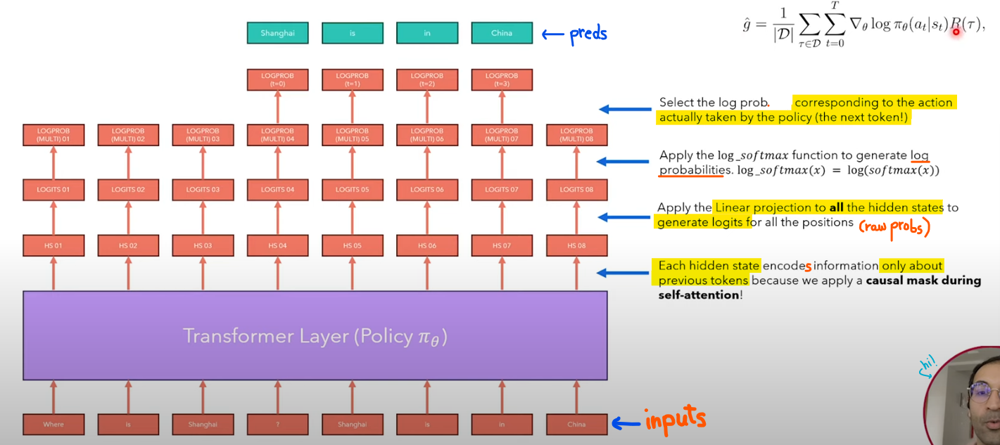
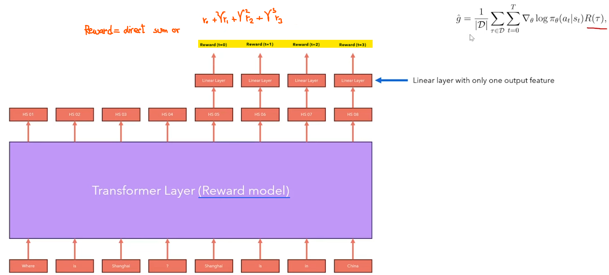

# Coding RLHF(and it's derivations) Scratch!
> Like the previous few repos, all the content here is inspired from [@hkproj](https://github.com/hkproj) Umar Jamil. Here is the [YouTube video](https://www.youtube.com/watch?v=qGyFrqc34yc). *What a Legend!*


## RL Setup

### Introduction


|  Term   |  Description   |
| --- | --- |
| **Agent** |  the cat |
| **State ($s_t$)** |  the position of the cat $(x, y)$ in the grid | 
| **Action ($a_t$)**|  at each position, the cat can move to one of the 4-directionally connected cells. If a move is invalid, the cell will not move and remain in the same position. Every time the cat makes a move, it results in a new state and a reward. | 
| **Reward model** | {0, -1, -10, +100} depending on moves to {empty cell, towards broom, towards bathtub, towards meat} | 
| **Policy ($π$)** |  Rules how the agent selects the action  to perform given the state it is in: $a_t \sim π(\cdot \| s_t)$ | 

**The goal in RL is to select a policy that maximizes the expected return when the agent acts according to it.**


### Connection to LMs

|  Term   |  Description   |
| --- | --- |
| **Agent** |  the LM |
| **State ($s_t$)** |  the prompt (input tokens) | 
| **Action ($a_t$)**|  which token to select as next token | 
| **Reward model** | rewarded for *good responses* and not rewarded for *bad responses* | 
| **Policy ($π$)** |  LM itself! It models the probability of the action space givn the current state of the agent: $a_t \sim π(\cdot \| s_t)$ | 

> How to define the reward model!

## Reward model for LMs

### Idea

Not easy to create a reward model for LMs because it would require us to create a dataset of prompts and responses and assign a universally accepted *reward* to each answer.

> It is much easier to compare answers instead of rating them! So we create multiple answers and ask humans which is preferred.

| Prompt | Answer1 (generated by LM) | Answer2 (generated by LM) | Chosen |
| --- | --- | --- | --- | 
| What is 2+2 | 4 | 2+2 is 4 | 1 | 
| Where is Delhi | Delhi is in India | India | 2  |


### Architecture

We use the hidden state of the last token of the response, send it to a Linear layer with one output feature and  use it as the value of reward


> The input is the question concatenated with the answer.

### Loss function (assuming only two possible answers)

Given that we have a dataset that defines which answer we liked based on a query, we can build a neural network that gives us a numeric score for each response. ***WHAT?***

```math
Loss = - \log \sigma ( r(x, y_{\text{winning answer}}) - r(x, y_{\text{losing answer}}) )
```
Loss is small when order is correct, very large when order is wrong.

> Remember $\sigma (x) = \dfrac{1}{1 + e^{-x}}$. It gives > 0.5 for positive $x$, < 0.5 for negative $x$

The HF implementation takes input a `model` which is of type `PretrainedModel` (same as `AutoModelForSequenceClassification`) which is an LM with a head on top (same as above!)


## Trajectories

### Idea

**POLICY ($\pi$)** \
Goal in RL is to SELECT A POLICY which maximises the EXPECTED RETURN when the agent acts ACCORDING TO IT

```math
\pi^{*} = \underset{\pi}{\argmax} ~ J(\pi)
```

**RETURN ($J$)** \
Expected return of a policy is the expected return over all possible trajectories 
```math
J(\pi) = \underset{\tau \sim \pi}{\mathbb{E}}[R(\tau)] = \int_{\tau} P(\tau | \pi) R(\tau)
```

**TRAJECTORY ($\tau$)** \
Series of (action, state), starting from an initial state

```math
\tau = (s_0, a_0, s_1, a_1, \dots)
```

**STATE ($s$)** \
Modelled as stochastic
```math
s_{t+1} \sim P(\cdot | s_t, a_t)
```

**PROBABILITY OF A TRAJECTORY** \
Policy takes input a State and gives probability over actions. <br> 
All states a $s_0 \xrightarrow{\pi} a_0 \rightarrow s_1 \xrightarrow{\pi} a_2$
```math
P(\tau | \pi) = \rho_{0} (s_0) \prod_{t=0}^{T-1} P(s_{t+1} | s_t, a_t) \pi(a_t | s_t)
```
Where $\rho_{0} (s_0)$ is probability of starting point of trajectory

> Think of term inside product as (action, state) $ \sim a_t, s_t \sim \pi(a_t | s_t) \cdot P(s_{t+1} | s_t, a_t) $. We multiply because all probabilities are independent. 

**DISCOUNTED REWARDS**\
Since we prefer immediate rewards instead of future

```math
R(\tau) = \sum_{t=0}^{\infty} \gamma^{t} r_t
```

### Trajectories for LMs

Series of prompts (state) and next tokens (actions)

```math
\tau = (s_0, a_0, s_1, a_1, \dots)
```

| Timestamp | State $s$ | Action $a$ |
| --- | --- | --- |
| 0: $(s_0, a_0)$ | Where is Delhi | Delhi |
| 1: $(s_1, a_1)$ | Where is Delhi. Delhi | is |
| 2: $(s_2, a_2)$ | Where is Delhi. Delhi is | in |
| 3: $(s_3, a_3)$ | Where is Delhi. Delhi is in | India |


## Policy Gradient Optimisation

Let policy $\pi_{\theta}$ be parametrised by parameters $\theta$. We want to maximise expected return using te policy i.e.

```math
J(\pi_{\theta}) = \underset{\tau \sim \pi}{\mathbb{E}}[R(\tau)]
```

Stochastic *Gradient Ascent* for maximising a function 
```math
\theta_{k+1} = \theta_{k} + \alpha \nabla_{\theta} J(\pi_{\theta}) |_{\theta_{k}}
```

- Gradient of the policy: **policy gradient**
- Algorithms that optimise the policy: **policy gradient algortihms**

### Derivation of Policy gradient

```math
\begin{align*}
\nabla_\theta J(\pi_\theta) &= \nabla_\theta \underset{\tau \sim \pi_{\theta}}{\mathbb{E}}[R(\tau)] \\

&= \nabla_\theta \int_{\tau} P(\tau|\theta) R(\tau) \quad \text{(Expand expectation)} \\

&= \int_{\tau} \nabla_\theta P(\tau|\theta) R(\tau) \quad \text{(Bring gradient under integral)} \\

&= \int_{\tau} P(\tau|\theta) \nabla_\theta \log P(\tau|\theta) R(\tau) \quad \text{(Log-derivative trick)} \\

&= \underset{\tau \sim \pi_{\theta}}{\mathbb{E}}  \left[ \nabla_\theta \log P(\tau|\theta) R(\tau) \right] \quad \text{(Return to expectation form)} \\

\end{align*}
```

```math
\therefore \nabla_\theta J(\pi_\theta) = \underset{\tau \sim \pi_{\theta}}{\mathbb{E}} \left[ \sum_{t=0}^{T} \nabla_\theta \log \pi_\theta(a_t|s_t) R(\tau) \right] \quad \text{(Expression for grad-log-prob)}
```

This  gradient is expectation over ALL policies( $\tau \sim \pi_\theta$) which can be a huge computation. We can approximate the gradient with a **SAMPLE MEAN** by collecting a set $\mathcal{D}$ of trajectories

```math
\hat{g} = \dfrac{1}{|\mathcal{D}|} \sum_{\tau \in \mathcal{D}} \sum_{t=0}^{T} \nabla_\theta \log \pi_\theta(a_t|s_t) R(\tau)
```

IMPORTANT : *The gradient estimator above multiplies the gradient of the log probs of each action in the current trajectory with the **rewards obtained in the entire trajectory.***

> Note: derivations given below

**Log-derivative trick** \
$\nabla_\theta \log \left[ P(\tau|\theta) \right] = \dfrac{1}{P(\tau|\theta)} \nabla_\theta P(\tau|\theta) \implies  P(\tau|\theta) \nabla_\theta \log \left[ P(\tau|\theta) \right] = \nabla_\theta P(\tau|\theta) $ 

**Expression for grad-log-prob** 

```math
\begin{align*}

P(\tau | \pi_\theta) &= \rho_{0} (s_0) \prod_{t=0}^{T-1} P(s_{t+1} | s_t, a_t) \pi(a_t | s_t) \\

\log P(\tau| \pi_\theta) &=  \log \left[ \rho_{0} (s_0) \right]  + \sum_{t=0}^{T-1} \left(  \log P(s_{t+1}| s_t, a_t) + \log \pi_\theta(a_t | s_t) \right) \\ 

\nabla_\theta \log P(\tau|\theta) &= \nabla_\theta \log \rho_{0} (s_0) + \sum_{t=0}^{T}
\left( \nabla_\theta \log P(s_{t+1}| s_t, a_t) +  \nabla_\theta \log \pi_\theta(a_t | s_t) \right) \\ 

&= \sum_{t=0}^{T} \nabla_\theta \log \pi_\theta(a_t | s_t)  \quad \text{(only last term survives since others don't have $\theta$)}

\end{align*}
```

## RECAP - REINFORCE Algorithm!
> We have an expression of the gradient of the expected reward w.r.t. parameters $\theta$ and approximated it using a sample mean $\hat{g}$

How to proceed

1. Create a NN that defines a policy (INPUT: current state of an agent OUTPUT: probability over the action space) -- ***Value based!?***
1. Use the NN to sample trajectories and their corresponding rewards 
1. Use sample to calculate the (approximated) gradient
1. Run stochastic gradient ascent to update the parameters of the policy
1. Repeat from #2


```math
\begin{align*}
\hat{g} &= \dfrac{1}{|\mathcal{D}|} \sum_{\tau \in \mathcal{D}} \sum_{t=0}^{T} \nabla_\theta \log \pi_\theta(a_t|s_t) R(\tau) \\
\theta_{k+1} &= \theta_{k} + \alpha \nabla_\theta J(\pi_\theta) |_{\theta_{k}} \\
\end{align*}
```

> *To generate trajectories for LMs*, we use questions from the dataset of preferences used earlier - model generates answer. We calculate the reward for the generated answer and train the model according to the approximated gradient of the policy. Since text generation results in a series of states (prompts) and actions (next tokens) we obtain a series of trajectories. 


### Calculating log probabilities of our policy (LM)



### Calculating rewards for each trajectories

Remember how the reward model is the LM with a linear layer!




## Problems with Gradient Policy Optimisation

1. We use a sample mean for gradient approximation -- will exhibit high variance (for small samples)

> Note: this is an unbiased estimator since it will converage to the true gradient

### Reducing variance - rewards to go

Remember how the gradient estimator multiplies the *gradient of the log probs of each action in the current trajectory* with the **rewards obtained in the entire trajectory**.

```math
\begin{align*}

\nabla_\theta J(\pi_\theta) &= \underset{\tau \sim \pi_{\theta}}{\mathbb{E}} \left[ \sum_{t=0}^{T} \nabla_\theta \log \pi_\theta(a_t|s_t) R(\tau) \right] \\

&\approx \dfrac{1}{N} \sum_{i=1}^{N} \left( \sum_{t=0}^{T} \nabla_\theta \log \pi_\theta(a_{i, t}|s_{i, t}) \right) \left( \sum_{t=0}^{T} r(s_{i,t}, a_{i,t})\right) \\

&\approx \dfrac{1}{N} \sum_{i=1}^{N} \left( \sum_{t=0}^{T} \nabla_\theta \log \pi_\theta(a_{i, t}|s_{i, t}) \right) \left( \sum_{t'=t}^{T} r(s_{i,t'}, a_{i,t'})\right) \quad \text{apparently it has been proven that past terms cancel out in expectation}

\end{align*}
```

The term $ \sum_{t'=t}^{T} r(s_{i,t'}, a_{i,t'})$ is commonly known as **rewards to go**, i.e. total reward if we start from $t=t'$ and act according to the policy

> Removing the initial terms results in less terms and hence less noise (variance)

### Reducing variance - subtract a baseline

Subtracting a baseline from the rewards to go still results in an unbiased estimator of the gradient

```math
\begin{align*}

\nabla_\theta J(\pi_\theta) &\approx \dfrac{1}{N} \sum_{i=1}^{N} \left( \sum_{t=0}^{T} \nabla_\theta \log \pi_\theta(a_{i, t}|s_{i, t}) \right) \left( \sum_{t'=t}^{T} r(s_{i,t'}, a_{i,t'}) - b \right) \quad \text{baseline $b$ can also be dependent on the state}

\end{align*}
```

As a baseline we choose a **VALUE FUNCTION** $V^{\pi}(s)$ that indicates what is the future expected reward if the agent **IS IN STATE** $s$ and acts according to policy. For example - 
- Value function should be high for *Where is Delhi? Delhi is*
- Value function should be low for *Where is Delhi? Chocolate muffins*

> Remember each prompt is a state!

## Estimating Value function $V^{\pi}(s)$


