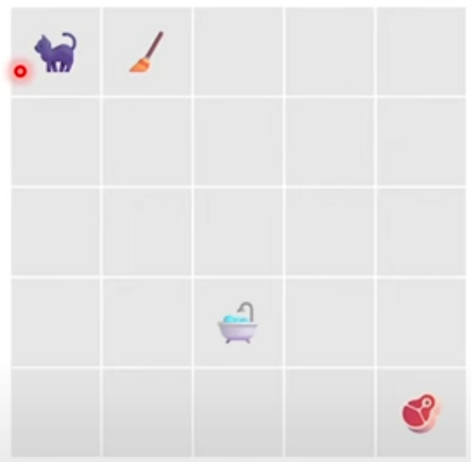
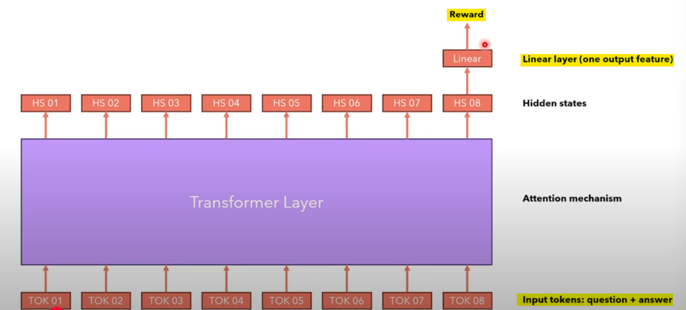
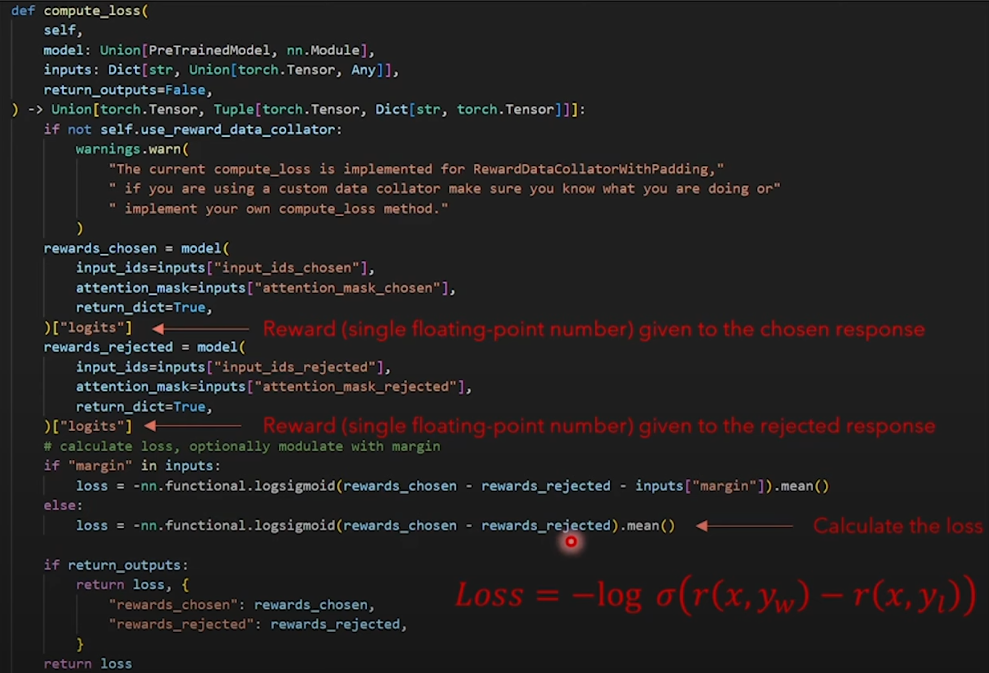

# Coding RLHF(and it's derivations) Scratch!
> Like the previous few repos, all the content here is inspired from [@hkproj](https://github.com/hkproj) Umar Jamil. Here is the [YouTube video](https://www.youtube.com/watch?v=qGyFrqc34yc). *What a Legend!*

## RL Setup

### Introduction

|  Term   |  Description   |
| --- | --- |
| **Agent** |  the cat |
| **State ($s_t$)** |  the position of the cat $(x, y)$ in the grid | 
| **Action ($a_t$)**|  at each position, the cat can move to one of the 4-directionally connected cells. If a move is invalid, the cell will not move and remain in the same position. Every time the cat makes a move, it results in a new state and a reward. | 
| **Reward model** | {0, -1, -10, +100} depending on moves to {empty cell, towards broom, towards bathtub, towards meat} | 
| **Policy ($π$)** |  Rules how the agent selects the action  to perform given the state it is in: $a_t \sim π(\cdot \| s_t)$ | 

**The goal in RL is to select a policy that maximizes the expected return when the agent acts according to it.**

### Connection to LMs

|  Term   |  Description   |
| --- | --- |
| **Agent** |  the LM |
| **State ($s_t$)** |  the prompt (input tokens) | 
| **Action ($a_t$)**|  which token to select as next token | 
| **Reward model** | rewarded for *good responses* and not rewarded for *bad responses* | 
| **Policy ($π$)** |  LM itself! It models the probability of the action space givn the current state of the agent: $a_t \sim π(\cdot \| s_t)$ | 

> How to define the reward model!

## Reward model for LMs

### Idea

Not easy to create a reward model for LMs because it would require us to create a dataset of prompts and responses and assign a universally accepted *reward* to each answer.

> It is much easier to compare answers instead of rating them! So we create multiple answers and ask humans which is preferred.

| Prompt | Answer1 (generated by LM) | Answer2 (generated by LM) | Chosen |
| --- | --- | --- | --- | 
| What is 2+2 | 4 | 2+2 is 4 | 1 | 
| Where is Delhi | Delhi is in India | India | 2  |

### Architecture

We use the hidden state of the last token of the response, send it to a Linear layer with one output feature and  use it as the value of reward

> The input is the question concatenated with the answer.

### Loss function (assuming only two possible answers)

Given that we have a dataset that defines which answer we liked based on a query, we can build a neural network that gives us a numeric score for each response. ***WHAT?***

$$ Loss = - \log \sigma ( r(x, y_{\text{winning answer}}) - r(x, y_{\text{losing answer}}) ) $$

Loss is small when order is correct, very large when order is wrong.

> Remember $ \sigma (x) = \dfrac{1}{1 + e^{-x}}$. It gives > 0.5 for positive $x$, < 0.5 for negative $x$

The HF implementation takes input a `model` which is of type `PretrainedModel` (same as `AutoModelForSequenceClassification`) which is an LM with a head on top (same as above!)

## Trajectories

**POLICY ($\pi$)** \
Goal in RL is to SELECT A POLICY which maximises the EXPECTED RETURN when the agent acts ACCORDING TO IT

$$ \pi^{*} = \underset{\pi}{\argmax} ~ J(\pi) $$

**RETURN ($J$)** \
Expected return of a policy is the expected return over all possible trajectories 
$$ J(\pi) = \underset{\tau \sim \pi}{\mathbb{E}}[R(\tau)] = \int_{\tau} P(\tau | \pi) R(\tau) $$

**TRAJECTORY ($\tau$)** \
Series of (action, state), starting from an initial state
$$ \tau = (s_0, a_0, s_1, a_1, \dots) $$

**STATE ($s$)** \
Modelled as stochastic
$$ s_{t+1} \sim P(\cdot | s_t, a_t) $$

**PROBABILITY OF A TRAJECTORY** 
$$ P(\tau | \pi) = \rho_{0} (s_0) \prod_{t=0}^{T-1} P(s_{t+1} | s_t, a_t) \pi(a_t | s_t) $$

**DISCOUNTED REWARDS**\
Since we prefer immediate rewards instead of future
$$ R(\tau) = \sum_{t=0}^{\infty} \gamma^{t} r_t $$